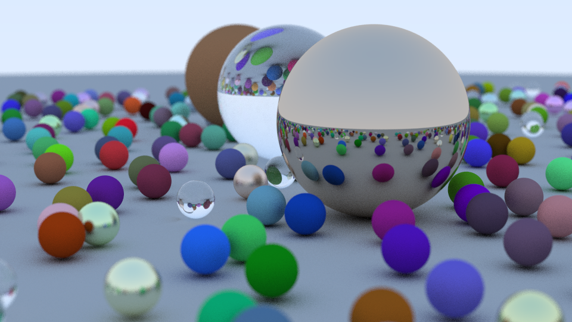

# Ray Tracing in One Weekend



Didactic ray tracing implementation using C++ adapted from [Ray Tracing in One Weekend][1] by [Peter Shirley][2].

## Requirements

- g++ 7.4.0
- make 4.1

## Compilation and Running

```md
1. Clone the repository: $ git clone https://github.com/r1walz/ray-tracing-in-one-weekend.git
2. cd ray-tracing-in-one-weekend
3. make
4. ./tracer >image.ppm
5. Open the `image.ppm` file using your favourite ppm image viewer
```

To clean up, use `$ make clean`.

[1]: https://github.com/RayTracing/raytracing.github.io
[2]: https://research.nvidia.com/person/peter-shirley
